# Nguyen Thanh Vinh

### Data Analyst • Business Intelligence • Supply Chain Analytics

Turning raw data into business decisions through analytics, automation, and scalable data solutions.

---

# 👋 About Me

I'm a **Data Analyst** specializing in **Business Intelligence, Data Warehousing, and Supply Chain Analytics**.

I build end-to-end data solutions—from data modeling and ETL pipelines to Power BI dashboards that help businesses make faster and better decisions.

---

# 🚀 Core Expertise

- 📊 Business Intelligence & KPI Dashboard
- 🏗️ Data Warehouse & ETL Pipeline
- 📦 Supply Chain Analytics
- 🤖 Machine Learning for Business Applications
- ⚡ Reporting Automation

---

# 🛠 Tech Stack

## 🔄 Data Pipeline

```mermaid
flowchart LR
    SRC["📥 SOURCES<br/><sub>ERP • API • SQL</sub>"] --> PY["🐍 PYTHON<br/><sub>Pandas • PySpark • ETL</sub>"]
    PY --> DW["🏗 DATA WAREHOUSE<br/><sub>Partitioned DW • 200M+ Records</sub>"]
    DW --> BI["📊 POWER BI<br/><sub>DAX • Real-time Dashboards</sub>"]
    BI --> ML["🤖 ML MODELS<br/><sub>TensorFlow • XGBoost • CLIP</sub>"]
    ML --> VAL["💼 BUSINESS VALUE<br/><sub>Data-driven Decisions</sub>"]

    style SRC fill:#ffffff,stroke:#38bdf8,stroke-width:2px,color:#0f172a
    style PY fill:#ffffff,stroke:#6366f1,stroke-width:2px,color:#0f172a
    style DW fill:#ffffff,stroke:#8b5cf6,stroke-width:2px,color:#0f172a
    style BI fill:#ffffff,stroke:#f59e0b,stroke-width:2px,color:#0f172a
    style ML fill:#ffffff,stroke:#ec4899,stroke-width:2px,color:#0f172a
    style VAL fill:#ffffff,stroke:#34d399,stroke-width:2px,color:#0f172a
```

 

# 🐍 Contribution

---

# 🎓 Education

**University of Economics Ho Chi Minh City**

Bachelor of Data Science

GPA: **3.95 / 4.0**

---

# 🏆 Highlights

- 🥇 1st Prize Business Analyst Competition
- 🥈 2nd Prize Economics Debate Competition
---

# 📫 Contact

📍 Ho Chi Minh City, Vietnam

📧 nguyenthanhvinh1234qn@gmail.com

💼 Open to Data Analyst, Business Intelligence and Analytics Engineering opportunities.
